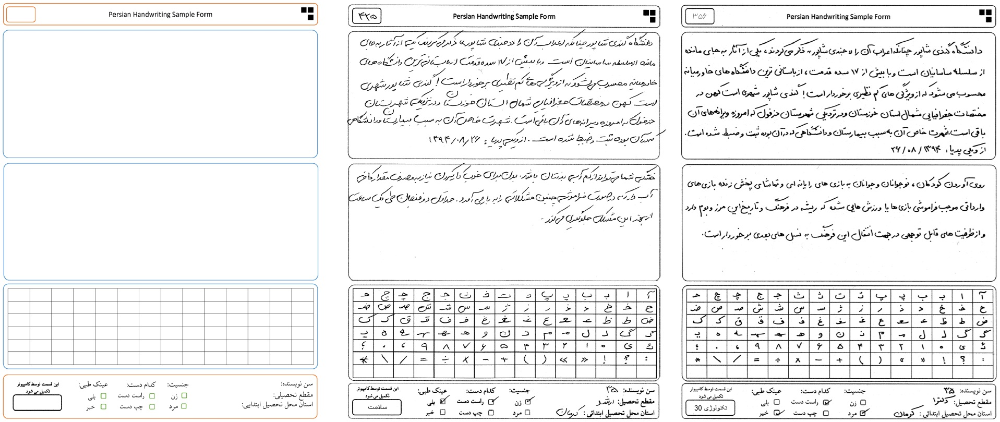
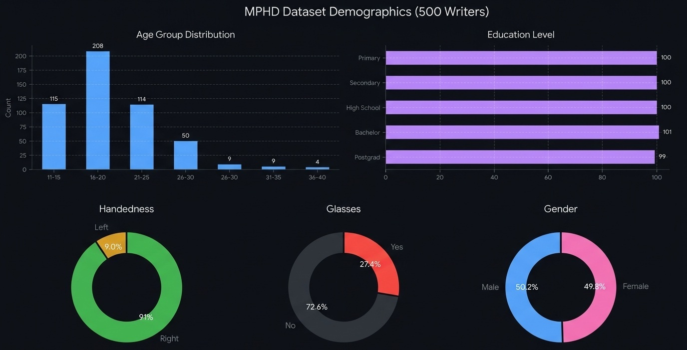
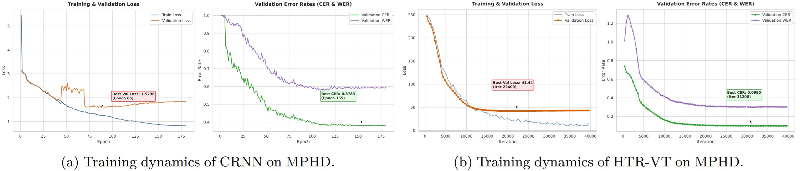
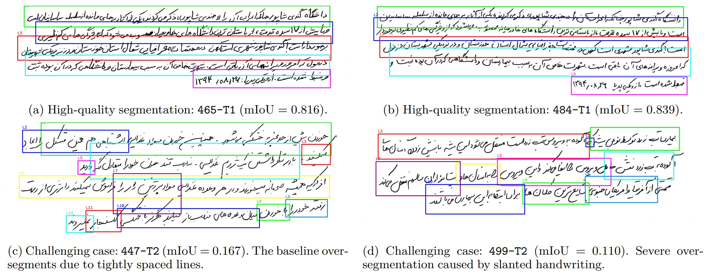
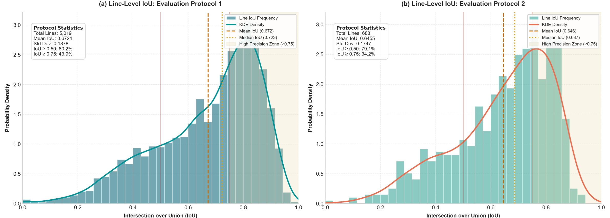
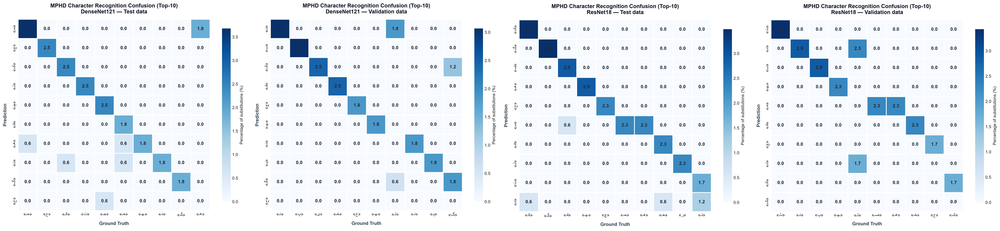

# MPHD: Multi-purpose Persian Handwriting Dataset
[](https://creativecommons.org/licenses/by-nc-nd/4.0/)

**MPHD** is a comprehensive multi-purpose multi-granularity Persian handwriting dataset featuring samples from 500 native writers, designed for handwriting text recognition (HTR), line segmentation, writer identification, character/digit recognition, and demographic studies.




## Dataset Organization & Directory Structure
The dataset contains **500 directories**, each corresponding to a single writer and named using the format `[ID]-[CODE]`.

### Folder Naming Schema: `[ID]-[CODE]` (e.g., `050-173010_3`)
- **ID:** Unique 3-digit writer identifier (e.g., `050`)
- **CODE:** 8-character string encoding writer demographic attributes:
  - **Digits 1–2:** Age (e.g., `17`)
  - **Digit 3:** Education (`1`: Primary, `2`: Secondary, `3`: High School, `4`: Bachelor, `5`: Postgraduate)
  - **Digit 4:** Gender (`0`: Female, `1`: Male)
  - **Digit 5:** Handedness (`0`: Right-handed, `1`: Left-handed)
  - **Digit 6:** Spectacles usage (`0`: No glasses, `1`: Uses glasses)
  - **Sub-code `[CAT]` (after `_`):** Text 2 thematic category (`1`: Sport, `2`: Health, `3`: Technology, `4`: Economy, `5`: History)


## Directory Structure per Writer
Each writer's directory contains the following assets:

```text
[ID]-[CODE]/
├── [ID]-[CODE].png             # Full-form scanned image (1240 × 1748 px, 96 dpi)
├── [ID]-[CODE].json            # JSON file with transcriptions & line-level annotations
│
├── [ID]-T1.png                 # Cropped fixed text image (Text 1)
├── [ID]-T1-Lines/              # Directory containing Text 1 line images
│   ├── [ID]-T1-Line1.png
│   ├── ...
│   └── [ID]-T1-Line[n].png
│
├── [ID]-T2-[CAT].png           # Cropped variable text image (Text 2)
├── [ID]-T2-[CAT]-Lines/        # Directory containing Text 2 line images
│   ├── [ID]-T2-[CAT]-Line1.png
│   ├── ...
│   └── [ID]-T2-[CAT]-Line[m].png
│
└── Chars/                      # Directory containing 90 isolated character images
    ├── [ID]_Char_01.png
    ├── ...
    └── [ID]_Char_90.png
```


## Dataset Statistics
- **Writers:** 500
- **Total Text Lines:** 5,021 (Text 1: 2,745 lines | Text 2: 2,276 lines)
- **Total Words / Characters:** 75,430 words | 333,545 non-space characters
- **Total Isolated Characters:** 45,000 (90 images/writer: 62 letter forms, 10 digits, 10 punctuation marks, 8 arithmetic symbols)

### Demographic Distribution
- **Gender:** Male 50.2% (251) | Female 49.8% (249)
- **Age Range:** 11 – 36 years (Mean: 18.3, Median: 17)
- **Education:** Primary (20%), Secondary (20%), High School (20%), Bachelor (20.2%), Postgraduate (19.8%)
- **Handedness:** Right-handed (91.0%) | Left-handed (9.0%)
- **Glasses:** Uses glasses (27.4%) | No glasses (72.6%)




## Dataset Access
A sample data file for one writer can be seen [here](samples/001-183001_3.zip).

The full dataset is available via DOI: [](https://doi.org/10.5281/zenodo.22659290)
and a Backup version at: [](https://doi.org/10.17632/2fcw6cd9gd.1)


## Annotation Format (`.json`)
Each writer directory contains a `.json` file housing ground-truth transcriptions:

```json
{
  "writer_id": "050",
  "demographics": {
    "age": 17,
    "education": "High School",
    "gender": "Female",
    "handedness": "Left-handed",
    "spectacles": false,
    "text2_category": "Technology"
  },
  "text1": {
    "full_text": "...",
    "lines": { "text": ["line 1...", "line 2..."] }
  },
  "text2": {
    "category": 3,
    "full_text": "...",
    "lines": { "text": ["line 1...", "line 2..."] }
  }
}
```
A sample JSON annotation file can be downloaded [here](samples/425-355001_2.json).


## Metadata (`metadata.csv`)
For bulk processing, filtering, and demographic analysis, a consolidated [`metadata.csv`](metadata.csv) file is provided in the root directory. It aggregates writer-level metadata and file paths across all 500 writers into a tabular format.

### Key Fields Included
* **Demographics:** `subject_id`, `age`, `education_name`, `gender_name`, `handedness_name`, `spectacle_name`, `text2_category_name`
* **Asset Paths:** `path_full_form`, `path_text1_image`, `path_text2_image`, `path_json`, `path_chars_folder`
* **Text Metrics:** Word, character, and line counts for Text 1 and Text 2


## Tasks Supported by MPHD
MPHD is designed to support multiple handwriting analysis tasks within a unified framework.


### Handwriting Text Recognition (HTR)
MPHD provides line-level annotated text for both fixed and variable content, enabling rigorous evaluation of HTR models under controlled and realistic conditions.
Official dataset preparation and train/val/test split generation script is available [here](benchmarks/htr/).




### Line Segmentation
The dataset includes full text-region images together with corresponding line-level ground truth, making it suitable for developing and benchmarking line segmentation algorithms.
Official dataset preparation and train/val/test split generation script is available [here](benchmarks/line_segmentation/).




### Writer Identification
With samples from 500 writers and a dual-text design (fixed + variable), MPHD supports both closed-set and open-set text-independent writer identification.
Official dataset preparation and train/val/test split generation script is available [here](benchmarks/writer_identification/).




### Character/Digit Recognition
Each writer contributed 90 isolated characters (letters, digits, punctuation, and symbols), providing a clean resource for fine-grained character and digit recognition.
Official dataset preparation and train/val/test split generation script is available [here](benchmarks/char_recognition/).




### Other Tasks
The dual-text structure and rich demographic metadata further enable document classification and demographic studies of handwriting style.


## Citation
If you use this dataset in your research, please cite the corresponding paper (currently under review):

```bibtex
@article{jampour2026mphd,
  title={MPHD: Multi-purpose Persian Handwriting Dataset for Text Recognition, Line Segmentation, Writer Identification, and Handwritten Analysis},
  author={Mahdi Jampour and others},
  journal={Under review},
  year={2026}
}
```
> **Preprint:** The preliminary version of the manuscript is available on my [personal webpage](https://jampour.ir/publications).

## Contact
- **Corresponding Author:** Dr. Mahdi Jampour
- **Email:** [mahdi.jampour [@] uni-hamburg.de]
- **Affiliation:** University of Hamburg


## License
This dataset is released under the **Creative Commons Attribution-NonCommercial-NoDerivatives 4.0 International (CC BY-NC-ND 4.0)** license for non-commercial academic and research purposes only.  
See the [LICENSE](LICENSE) file for full terms.

