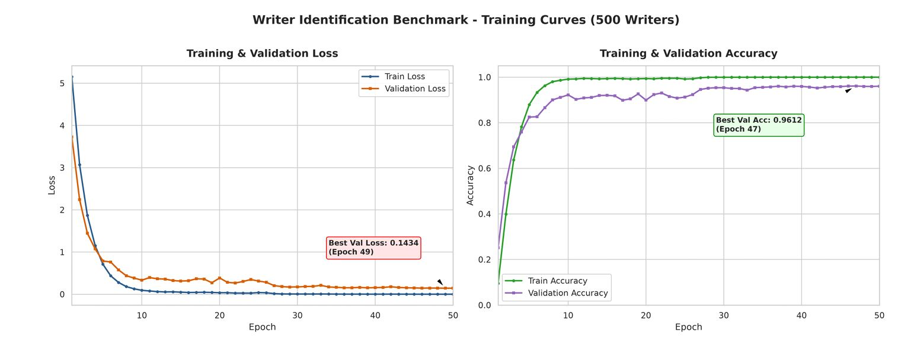

# MPHD Writer Identification Benchmark

This directory contains the baseline implementations for **writer identification on the MPHD (Multi-Purpose Persian Handwriting Dataset)**.

Two complementary evaluation protocols are provided:

- **Closed-Set Writer Identification** — identification among 500 known writers.
- **5-Fold Open-Set Writer Identification** — identification of known writers while detecting samples from unknown writers.

The baselines use patch-based visual representations extracted from handwriting documents and aggregate patch-level predictions at the document level.

---

## 1. Repository Structure


### Scripts

| Script                                      | Protocol        | Description                                               |
| ------------------------------------------- | --------------- | --------------------------------------------------------- |
| `mphd_writer_id_benchmark_Confirmed.py`     | Closed-set      | 500-class writer identification                           |
| `mphd_writer_id_openset_5fold_Confirmed.py` | 5-fold open-set | Known-writer identification with unknown-writer rejection |

---

## 2. Dataset Organization

The benchmark assumes the following MPHD directory structure:

```text
MPHD/
├── [Writer_ID_1]/
│   ├── [ID]-T1.png
│   └── [ID]-T2-*.png
├── [Writer_ID_2]/
│   ├── [ID]-T1.png
│   └── [ID]-T2-*.png
├── ...
└── [Writer_ID_500]/
    ├── [ID]-T1.png
    └── [ID]-T2-*.png
```

* **T1**: fixed-text handwriting document.
* **T2**: variable-text handwriting documents.
* Each writer has a separate directory.

The benchmark identifies documents using the following filename patterns:

```text
*-T1.png
*-T2*.png
```

---

## 3. Benchmark Setup

### Closed-Set Writer Identification

The closed-set benchmark uses all **500 writers** as classification identities.

T1 documents are used for training and validation, while T2 documents are held out for evaluation. T1 documents are divided into patches, and the resulting patch samples are used for training and validation.

### 5-Fold Open-Set Writer Identification

For open-set evaluation, the 500 writers are divided into **five disjoint folds**.

For each fold:

```text
400 writers → Known
100 writers → Unknown
```

The model is trained using the known writers. Unknown-writer samples are used for threshold calibration and open-set evaluation. Across the five folds, each writer is held out as an unknown writer once.

The writer partition is reproducible using:

```text
FOLD_SEED = 42
```

---


## 4. Training Example

The following figure shows a representative training run of the closed-set writer identification baseline on **500 writers**.



The figure provides a visual reference for the training and validation behavior of the baseline.

---

## 5. How to Run

Set the dataset path in the corresponding script if necessary:

```python
DATA_ROOT = "../MPHD"
```

The path is interpreted relative to the current working directory.

### Closed-Set

```bash
python mphd_writer_id_benchmark_Confirmed.py
```

### Open-Set

```bash
python mphd_writer_id_openset_5fold_Confirmed.py
```

The open-set benchmark trains five separate models, one for each writer fold.

---

## 6. Generated Outputs

### Closed-Set

```text
writer_id_best.pt
cmc_curve.png
```

* `writer_id_best.pt`: best model checkpoint selected using validation performance.
* `cmc_curve.png`: document-level CMC curve.

### Open-Set

```text
checkpoints_openset_5fold/
├── fold1_best.pt
├── fold2_best.pt
├── fold3_best.pt
├── fold4_best.pt
└── fold5_best.pt

openset_5fold_results.json
```

The JSON file contains per-fold evaluation results, fold assignments, calibration thresholds, and aggregated open-set metrics. It is updated after each completed fold.


